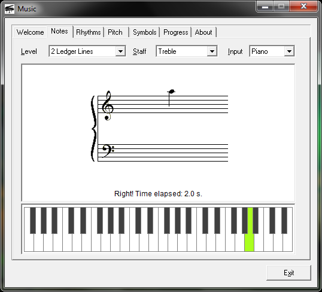

# Music Drill

**Music Drill** shows you notes on a staff and times how long it takes you to enter the correct note, either clicking on the note name or on the correct piano key.

## Building

It's written in C++/MFC and compiles with Microsoft Visual C++ 6.0.

## License

GPL

